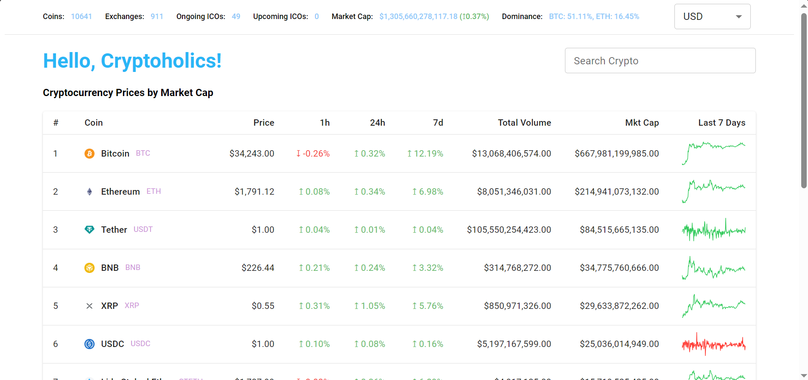

## Cryptocurrency Dashboard Using Coingecko API

Following assumptions and decisions were made while developing this:

- Responsiveness of the UI was not considered.
- When writing the test cases, button clicks and data loading was not tested due to limited timeline.
- The application was built in way to function without a .env file.



## Getting Started

First, run the development server:

```bash
npm i
npm run dev
```

Open [http://localhost:3000](http://localhost:3000) with your browser to see the result.
